# flutter_fundamental_part1

## PRAKTIKUM 1
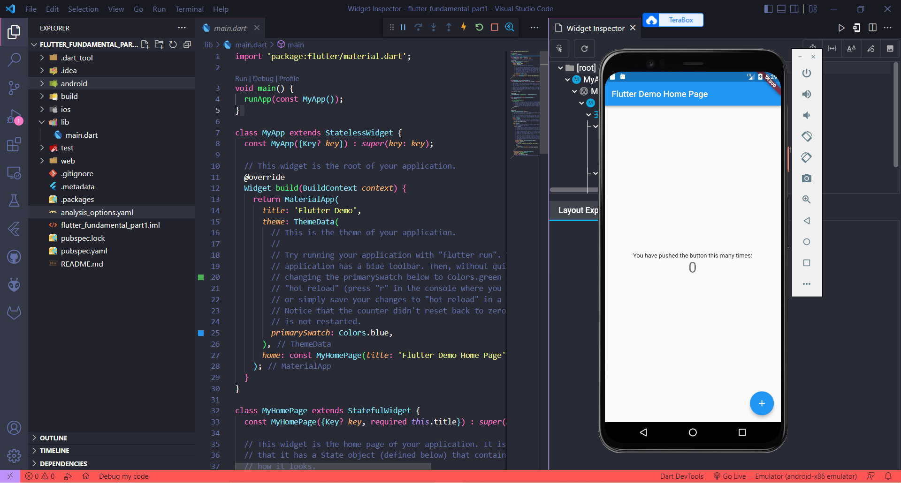
## PRAKTIKUM 3
Langkah 1
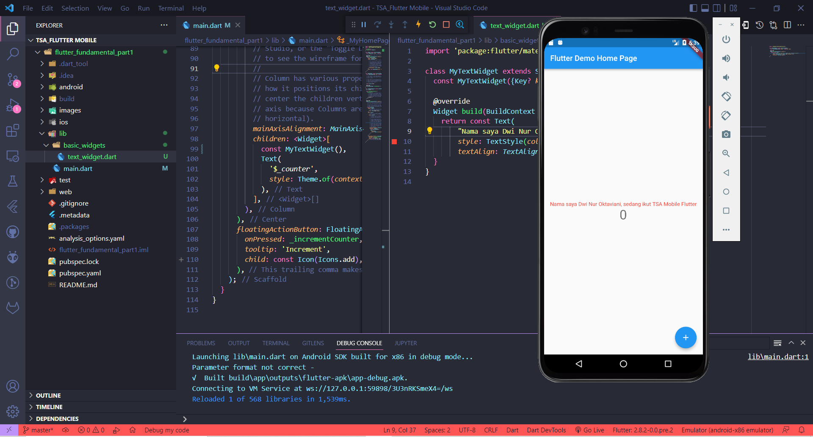
Langkah 2
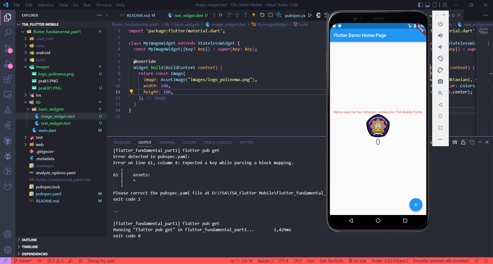
## PRAKTIKUM 4
Langkah 1
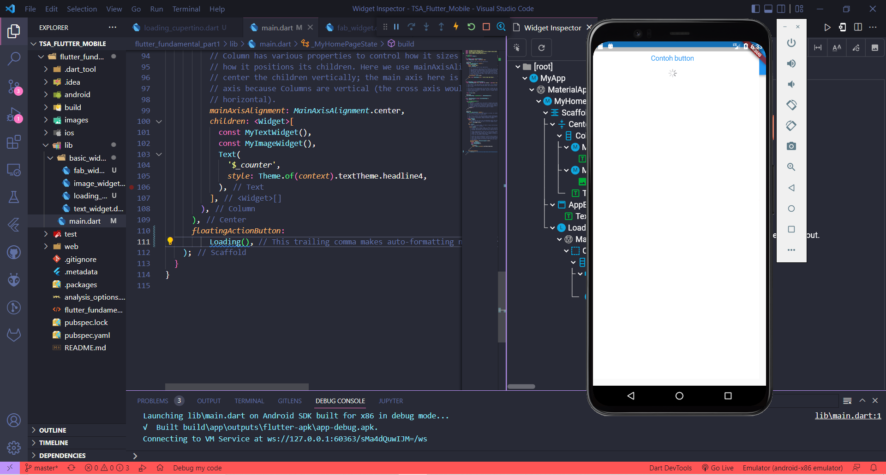
Langkah 2
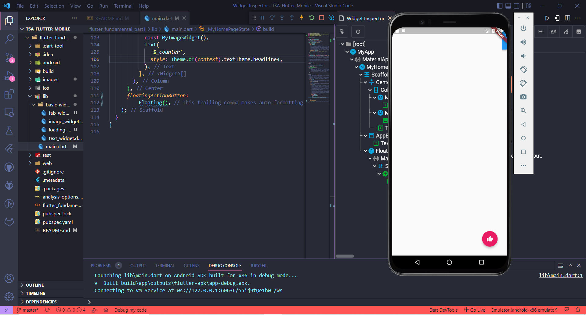
Langkah 3
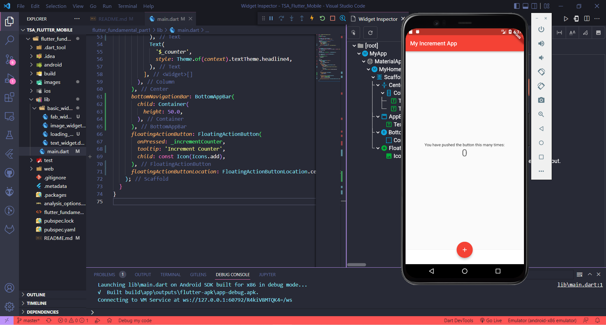
Langkah 4
Tampilan Awal
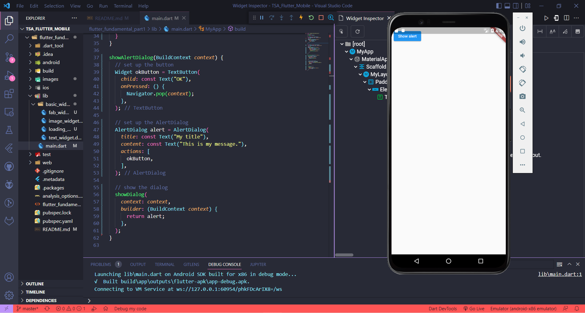
Setelah Klik Button
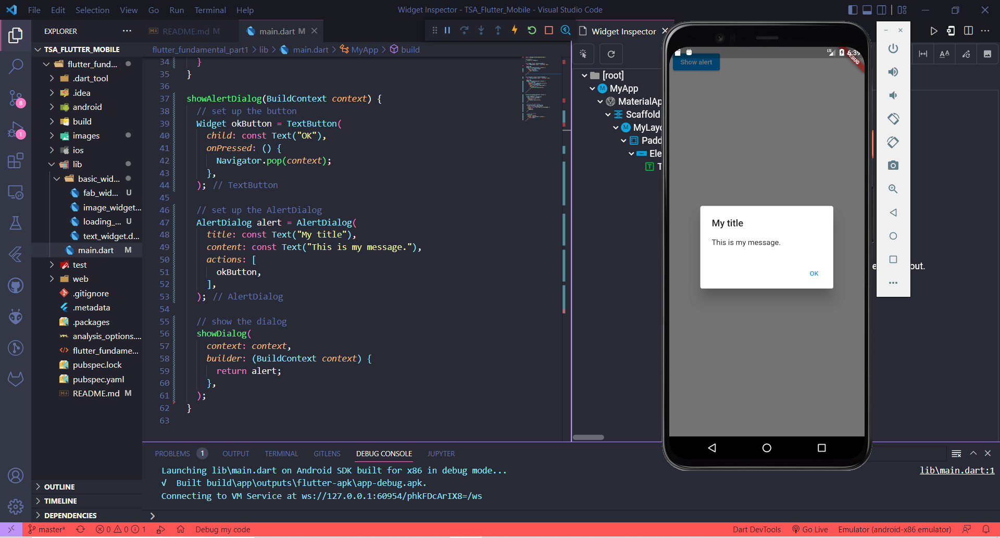
Langkah 5
Tampilan Awal

Mengisi Field
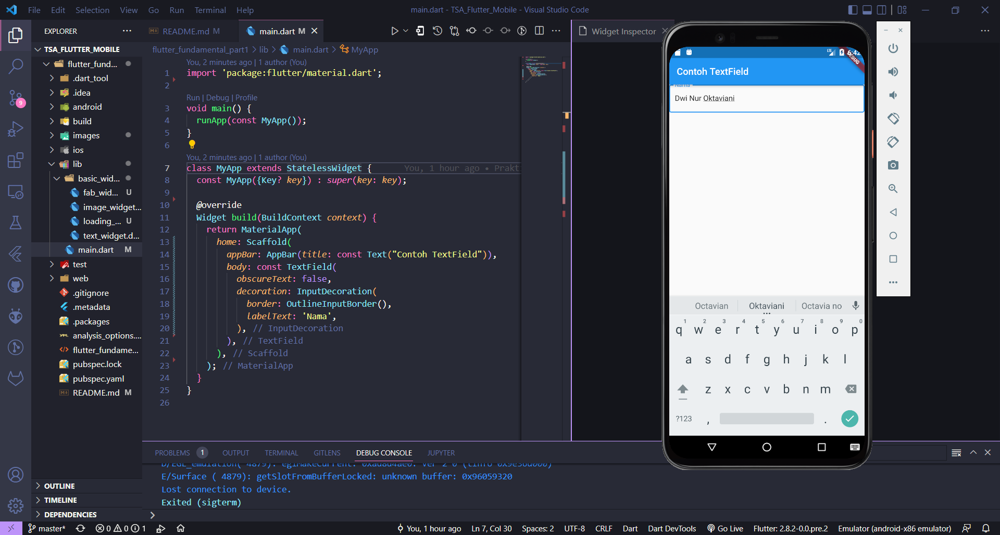
Langkah 6
Tampilan Awal

Setelah Klik Button
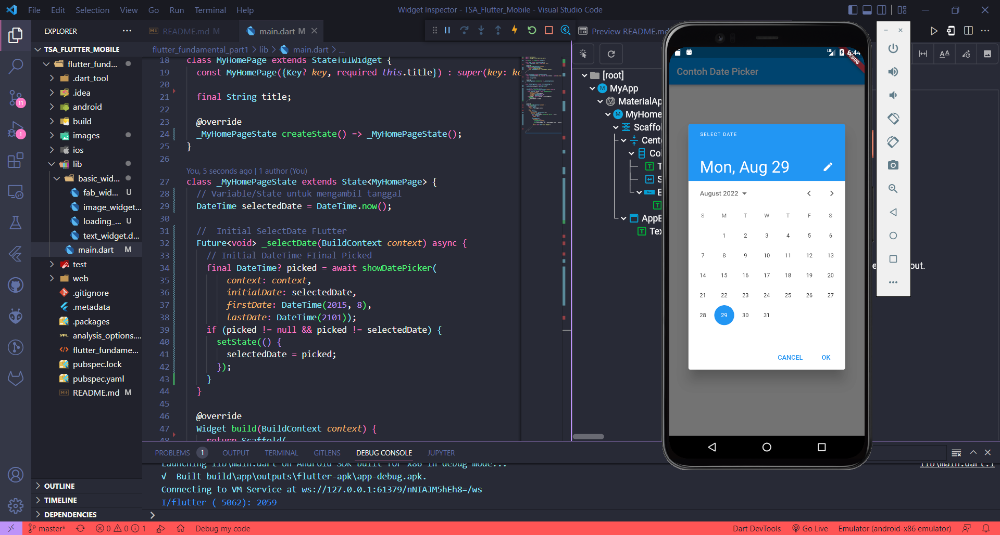
Setelah Perubahan Tanggal
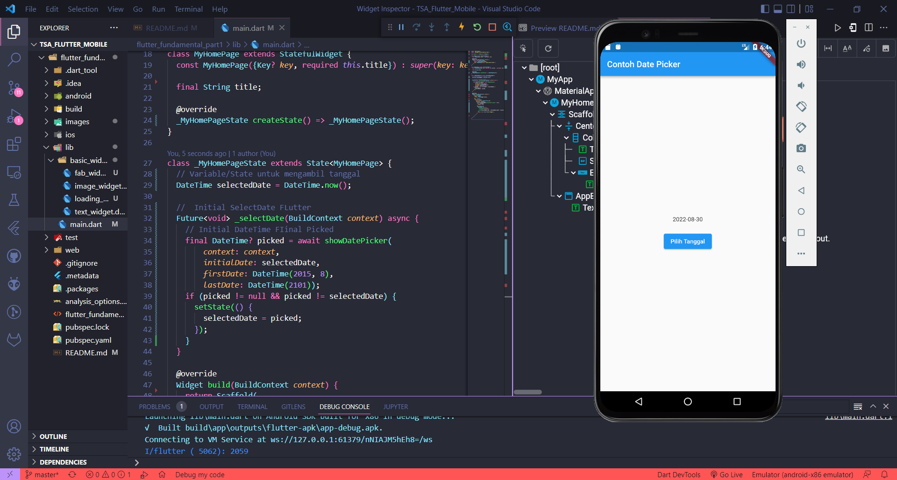

